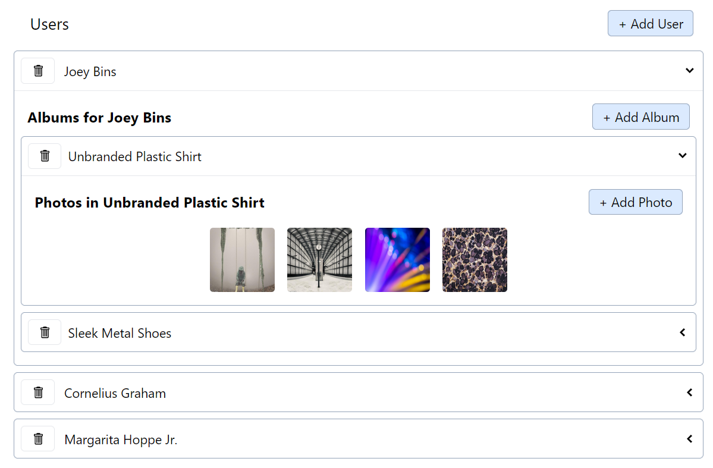

# Media

## Description

This React-Redux app allows the user to add users, albums, photos as well as deleting them. It uses Async Thunks and Redux Toolkit Query to handle data from the app to the JSON server.

## Images

Here is an image of the app:

## Dependencies

This project uses the following dependencies:

- Faker to generate massive amounts of fake (but realistic) data for testing and development.
- Redux Toolkit to simplify the development workflow with Redux.
- Axios for a promise-based HTTP Client for node.js and the browser.
- JSON Server to get a full fake REST API.
- Classnames for conditionally joining classNames together.
- react-icons to include popular icons in your React projects, which utilizes ES6 imports that allows you to include only the icons that your project is using.
- Tailwind CSS framework to add style.
- React-Redux to let React components read data from a Redux store, and dispatch actions to the store to update state.

## Acknowledgments

This project is made possible by:

- [Stephen Grider](https://www.udemy.com/user/sgslo/) and his course [Modern React with Redux [2023 Update]](https://www.udemy.com/course/react-redux/).
